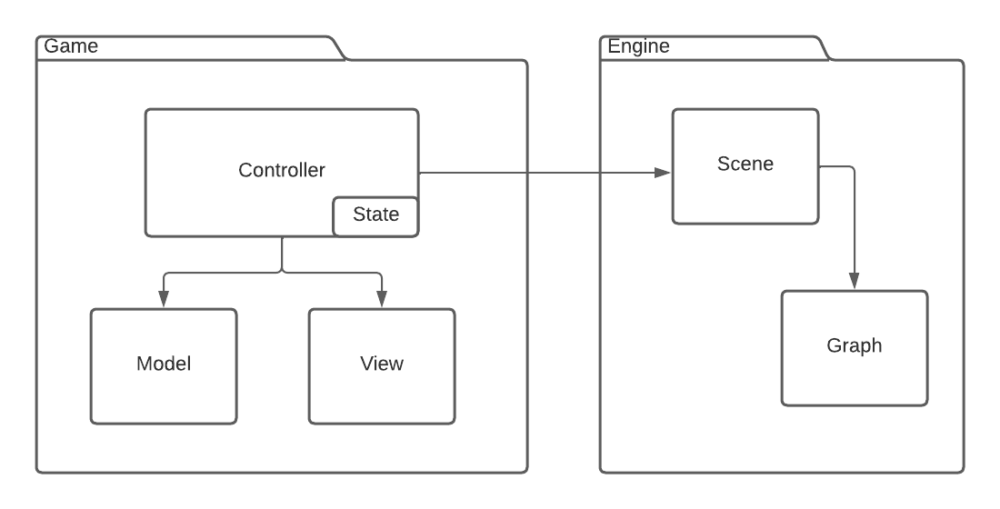

# SGI 2022/2023 - TP3

## Group: T05G04

| Name          | Number    | E-Mail                   |
| ------------- | --------- | ------------------------ |
| Bruno Mendes  | 201906166 | up201906166@edu.fe.up.pt |
| Fernando Rego | 201905951 | up201905951@edu.fe.up.pt |

---

## Code architecture

Starting from TP2's work, a powerful but non interactable graphics engine, we felt that it would be of great benefit to make only needed adjustments to its abilites, for example, to accomodate for text spritesheets, and keep it completely agnostic to its usage.

This decision means that the developed game is bundled in a package that "orchestrates" the scene and its selected graph without it knowing about it. This reduces code coupling and contributes to a great development experience.

The main class, _AppController_, is responsible for switching the graph used in the scene and injects its scene switcher function in the _GameController_ it creates. The _GameController_ instanciates other controllers, injecting itself as the context for other controllers' usage. It is responsible for receiving user events, such as picking an object, and dispatching an appropriate action depending on the [state](https://en.wikipedia.org/wiki/State_pattern). These might include changing the _Game_ model and animating a piece, for example, in response to a move.

The scene cannot call directly _GameController_ functions, since it does not depend on it. To surpass this, it is [observable](https://en.wikipedia.org/wiki/Observer_pattern) by interested classes, notifying them in case of events.

## Graphical engine changes

The graphics engine ported from TP2 had its XML specification updated to support more features, without breaking backwards compatibility:

- The `component` tag has now two new optional properties: `visible` and `pickable`, which default, respectively to 1 and 0. These are self explanatory and are very useful for dynamic orchestration of the scene.
- The `text` tag is now an optional child of `component`. It represents text to be drawn, centered, on top of the component (using the text shader). `scale_y`, `scale_x`, `x_off`, `y_off` and `gap` are optional properties that allow micro adjustments to the spacing and positioning of the text.
- The `highlight` tag now has an optional `enabled` property that defaults to 1.
- The new optional `includes` top-level tag (that must sit, if exists, before the `views` tag) allows to `include` other graphs' primitives, components, materials and textures in the current one. When encountering this tag, the parser loads the included graphs into the current one before continuing the parsing, so that external referenced assets exist in the time of their read.

As the relevant actions for the application usage can be made using the board's pickable buttons, we are closing the `dat.GUI` interface by default to provide an immersive experience. It can still be opened manually to play with all TP2's scene settings, such as lights or highlights toggling. It is refreshed automatically every time the graph changes, but we did notice that the properties do not auto update if changed via game and not the interface (for example, "travelling" via board button does not update the selected scene field on `dat.GUI`.). Also, even closed by default, its label's text is _Close Controls_ instead of _Open Controls_. We are assuming that these are bugs related to this library's version shipped with `WebCGF`.

Note that on game development (explained below) we rely solely on semantic ID names for hooking scene components to view models. This makes sure that the graphics engine layer stays agnostic. The `board` is included in the three scenes using the `include` tag so that any change to `board.xml` is reflected in all scenes.

## Game development

### Selection of pieces and positions

To play checkers firstly it is needed to choose a piece and then the position where I'm going to play the piece. To choose either the piece or the position, the application is notified by a picking event where the picked component is used to decide what to do next. For example, if we didn't choose any piece yet and we pick a piece with the right color (depending on the turn of the game), the picked piece will be selected and the application will wait for the picking of the final position of the movement. In case of the piece is already chosen and the application is notified for a picking event where the picked component is anything but a valid position (following the rules of the game), the selected piece will be unselected and it is necessary to choose a valid piece again.

### Piece movements

When a valid movement is made, the piece cannot be simply teleported. It is important for the user experience that the application have a smooth flow and every component acts as close as possible to the real world. To do that, animations are injected to the application to create a smooth motion of the pieces. There are to mainly animations that can be injected to move the pieces:

- **Move animation**
- **Capture animation**

### Move animation

In this animation, we move a piece based on the position in the game board and the selected position by the user to make a move. To do this, we create the class _MyPieceAnimation_, that extends the class _MyKeyframeAnimation_, that, in addition to the polished animation already created, allow the application to inject _GraphKeyframe_ objects to the piece animation when it is triggered by the user actions which lead to an animation that can change throughout the execution of the program. Besides the smooth motion, if the movement is a capture, then the animation checks for collision with the captured pieces and when a collision is detected, a **Capture animation** is injected.

### Capture animation

This animation is injected in the application when a collision is detected, and the captured piece jumps in the shape of a parabola from the game board to the auxiliar board. The parabola formula used to make the jump is the following:

`y = (x * 4 - 2)² + 4, x ∈ [0,1]`  
Where y corresponds to the height of the jump and x represents the percentage of the time in the animation

This allow us to make a pretty and smooth animation when a piece is captured

### Camara movement

## Visualization

### Illumination

### Game scenes

## Generic game features

### Undo

### Camera rotation

### Movie

### Move hints

### Time measure

## Challenges faced (and solutions employed)

- The chosen code architecture reflects our belief that it was not maintainble to inject application specific artifacts in the developed engine. It was already challenging enough to deal with a big codebase that was loosely coupled.
- While Javascript "exposes" a single threaded interface to the user, its callback nature allows for several race conditions. In the context of this work, it is mainly related to graph switching and loading: when it happens, the controller needs to hook the graphical objects to its model, but there might already be work being done to the scene. Some problems and its solutions:
  - A turned on spotlight is being updated to follow the piece movement while the user switches the scene and switches itself off a bit later on the new scene. When returning to the old scene, its graph still has that light on, confusing the game controller. We worked around this by disabling the spotlight when switching the scene and let the next movement use the newly hooked spotlight.
  - Every graph has a different instance of the board. This means that if an animation is being updated on one graph and the user travels, the scene now makes no sense since the object was stationary, there, before, and the initial positions are different. This means that the game is basically unplayable if this issue was not tackled. We solved this by copying the reference to active animations and textures from the old to the new graph every time it is switched.
- Using traditional spritesheets to draw text raises some issues, such as the letters not having the same width, which results in weird spacing between letters when drawn. There are some workarounds that could have been explored, such as centering the text on each character box on the font asset, or even determining the frame of the letter with a color detecting algorithm, but this was not the scope of this work. We resorted to avoiding using tiny letters such as `I`, which is a bit naive, but works quite well in maintaing a good text look.

## Conclusions and future work

This pratical work was the most interesting and challenging of the three, requiring us to code a very interactive system that responds very differently depending on the state. This, coupled with new graphical/mathematical challenges, such as detecting collisions or animating objects, made it a challenging although very rewarding project.

In the end, we cannot help not to mention that we'd love to have more time to further improve on this project, perhaps working on an artificial intelligence or a proper, separate backend, to implement AJAX calls.
