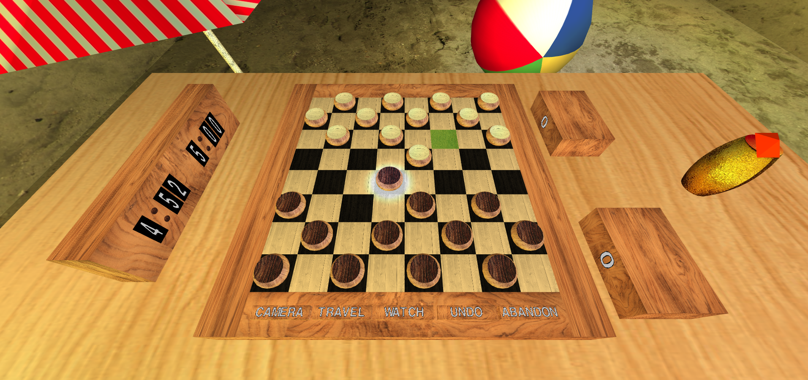
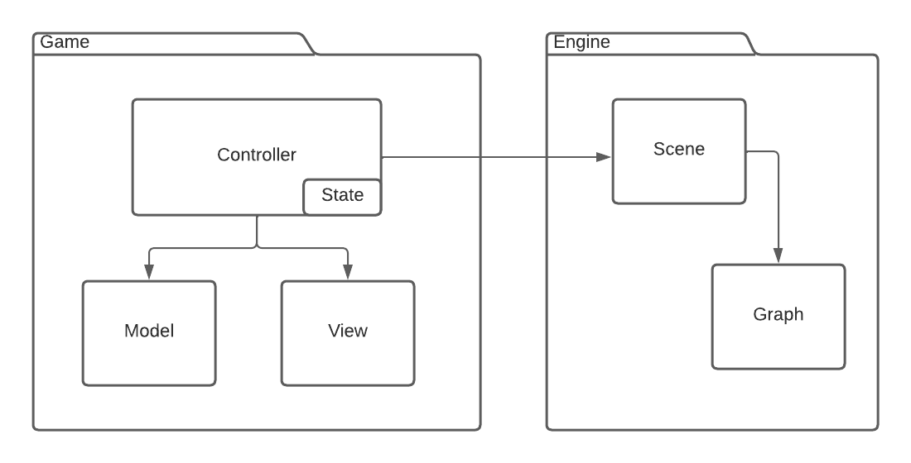
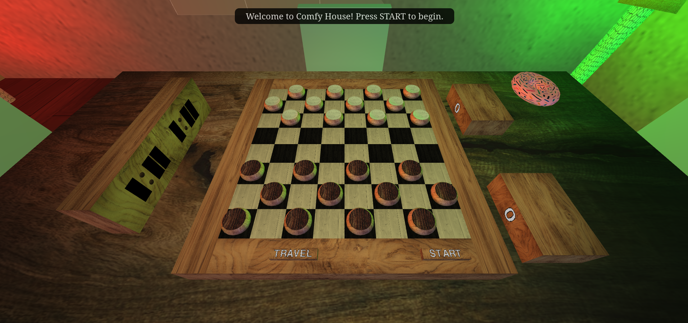
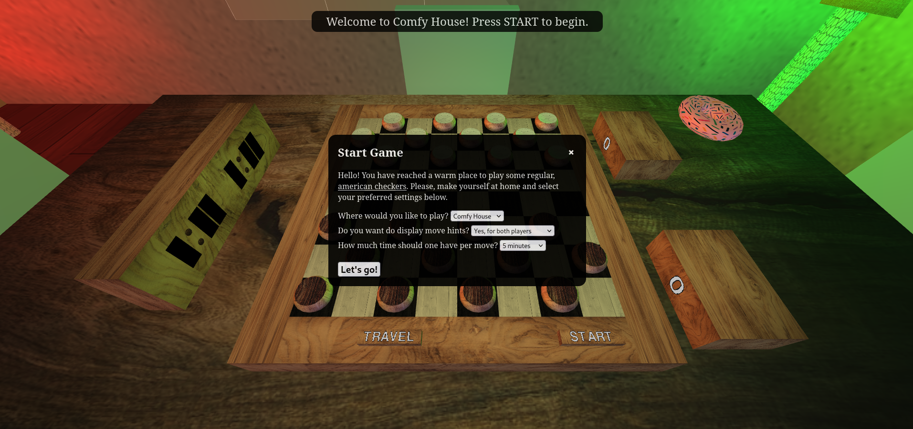
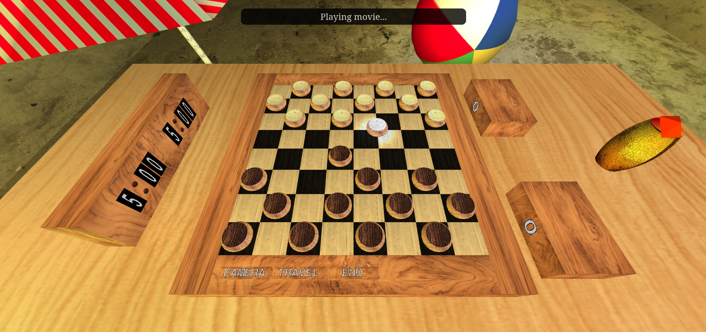
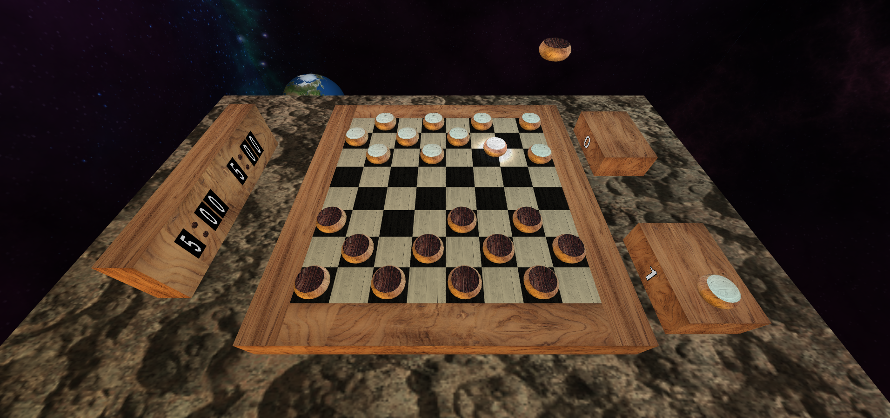
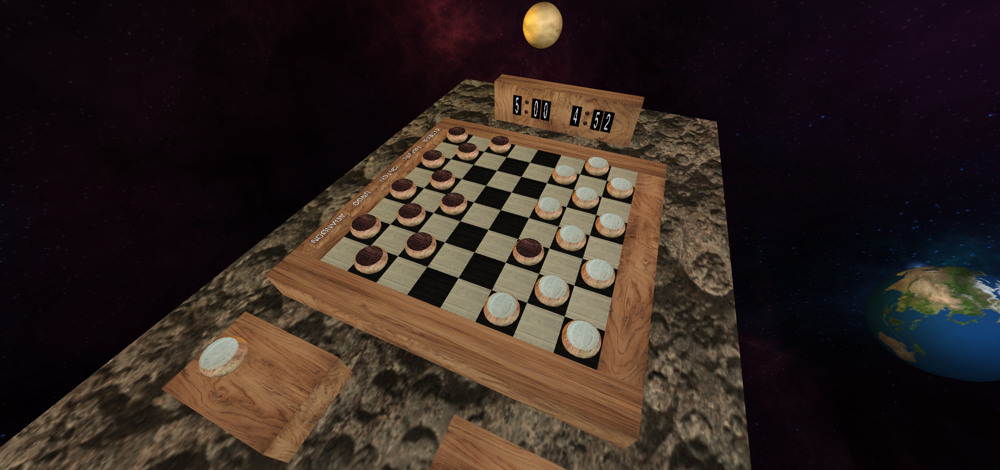

# SGI 2022/2023 - TP3

## Group: T05G04

| Name          | Number    | E-Mail                   |
| ------------- | --------- | ------------------------ |
| Bruno Mendes  | 201906166 | up201906166@edu.fe.up.pt |
| Fernando Rego | 201905951 | up201905951@edu.fe.up.pt |

---

## Code architecture

Starting from TP2's work, a powerful but non interactable graphics engine, we felt that it would be of great benefit to make only needed adjustments to its abilites, for example, to accomodate for text spritesheets, and keep it completely agnostic to its usage.

This decision means that the developed game is bundled in a package that "orchestrates" the scene and its selected graph without the latter knowing about the former. This reduces code coupling and contributes to a great development experience.

The main class, _AppController_, is responsible for switching the graph used in the scene and injects its scene switcher function in the _GameController_ it creates. The _GameController_ instanciates other controllers, injecting itself as the context for other controllers' usage. It is responsible for receiving user events, such as picking an object, and dispatching an appropriate action depending on the [state](https://en.wikipedia.org/wiki/State_pattern). These might include changing the _Game_ model and animating a piece, for example, in response to a move.

The scene cannot call directly _GameController_ functions, since it does not depend on it. To surpass this, it is [observable](https://en.wikipedia.org/wiki/Observer_pattern) by interested classes, notifying them in case of events, such as time elapsed, graph loaded or picking.

## Graphics engine changes

The graphics engine ported from TP2 had its XML specification updated to support more features, without breaking backwards compatibility:

- The `component` tag has now two new optional properties: `visible` and `pickable`, which default, respectively to 1 and 0. These are self explanatory and are very useful for dynamic orchestration of the scene.
- The `text` tag is a new optional child of `component`. It represents text to be drawn, centered, on top of the component (using the text shader). `scale_y`, `scale_x`, `x_off`, `y_off` and `gap` are optional properties that allow micro adjustments to the spacing and positioning of the text.
- The `highlight` tag now has an optional `enabled` property that defaults to 1.
- The new optional `includes` top-level tag (that must sit, if exists, before the `views` tag) allows to `include` other graphs' primitives, components, materials and textures in the current one. When encountering this tag, the parser loads the included graphs into the current one before continuing the parsing, so that external referenced assets exist in the time of their read.

As the relevant actions for the application usage can be made using the board's pickable buttons, we are closing the `dat.GUI` interface by default to provide an immersive experience. It can still be opened manually to play with all TP2's scene settings, such as lights or highlights toggling. It is refreshed automatically every time the graph changes, but we did notice that the properties do not auto update if changed via game and not the interface (for example, "travelling" via board button does not update the selected scene field on `dat.GUI`). Also, even closed by default, its label's text is _Close Controls_ instead of _Open Controls_. We are assuming that these are bugs related to this library's version shipped with `WebCGF`.

Note that on game development (explained below) we rely solely on semantic ID names for hooking scene components to view models. This makes sure that the graphics engine layer, where the parser resides, stays agnostic. The `board` is included in the three scenes using the `include` tag so that any change to `board.xml` is reflected in all scenes.

## Core game features

### Selection of pieces and positions

To play checkers firstly it is needed to choose a piece and then the position where I'm going to play the piece. To choose either the piece or the position, the application is notified by a picking event where the picked component is used to decide what to do next. For example, if we didn't choose any piece yet and we pick a piece with the right color (depending on the turn of the game), the picked piece will be selected and the application will wait for the picking of the final position of the movement. In case the piece is already chosen and the application is notified for a picking event where the picked component is anything but a valid position (following the rules of the game), the selected piece will be unselected and it is necessary to choose a valid piece again.

### Piece movements

When a valid movement is made, the piece cannot be simply teleported. It is important for the user experience that the application has a smooth flow and every component acts as close as possible to the real world. To do that, animations are injected to the application to create a smooth motion of the pieces.

#### Move animation

In this animation, we move a piece based on the position in the game board and the selected final position by the user. To do this, we use the class _MyPieceAnimation_, that extends the class _MyKeyframeAnimation_, that, in addition to the polished animation already created, allows the application to inject _GraphKeyframe_ objects to the piece animation when it is triggered by the user actions which lead to an animation that can change throughout the execution of the program. Besides the smooth motion, if the movement is a capture, then the animation checks for collision with the captured pieces and when a collision is detected, a _Capture animation_ is injected.

#### Capture animation

This animation is injected in the application when a collision is detected, and the captured piece jumps in the shape of a parabola from the game board to the auxiliar board.

> We model the movement with `y = -(x * 4 - 2)² + 4, x ∈ [0,1]`, where y corresponds to the height of the jump and x represents the percentage of the time in the animation.

This allows us to make a pretty and smooth animation when a piece is captured.

As an added bonus, the captured pieces' stack for each player has two spots, so that the pieces stack does not grow too much: the captured pieces land position alternate between the two spots.

## Eye candy

### Illumination

The illumination can be divided in two important aspects, the general illumination and the game illumination.

Each scene, that is explained in the next section with more detail, has its specific lights to provide the most adequate illumination depending on the situation and what the scene represents. For example, while the beach scene has stronger and warmer lights than the comfortable living room, the space scene has darker and bluer lights, has it is supposed to be a night scene.

The game has its own **spotlight** that illuminates the pieces that the user picks during the game, and, when a move is made, the spotlight follows the piece that is moving, keeping the piece illuminated during the **move animation**

### Game scenes

#### Comfortable living room

The first scene is the previous comfortable living room developed in TP1 and TP2 but with the game board, timers and auxiliar boards in the dinner table to play a nice game of checkers.

#### Beach

The second scene resembles a beach located somewhere in the world, in the end of an afternoon. A drink seats above a beach table so that players can hydrate themselves during the game. A beach towel and some sun umbrellas complete this dreamy scenario.

#### Space

The third scene is a representation of a part of the universe with several planets in their orbits. In the middle of the scene there is an asteroid which has the game board, timers and auxiliar boards on top to play a nice game of checkers.

## Additional game features

### Undo

One can undo if playing an active game with 1 or more moves, via the pickable board button for the effect. The game model stores the list of the moves and the board after each move, so undoing there is straightforward. On the graphical side of things, an animation is injected on the last played piece from the final position to the initial position of the last move, and captured pieces, if any, are returned to the board, similarly to how they left, but on reverse. The text marker is also updated to remove the now in game pieces.

### Camera rotation

One can rotate the camera to the other side of the board, via the pickable board button for the effect. The camera is also switched automatically to the next to play side, while playing. This is done by rotating the camera 180 degrees around the board's center, which should be the camera's target specificed in the XML. Some things that we kept in mind to make the switching consistent:

- The rotation should make sense, in the way that the board stays visible in the screen and that it lands on the desired position. This means that we need to "put" the camera in front of the board, in its original position (when the graph loaded), discarding previous camera movement by dragging the mouse around the scene.
- If the user switches the camera manually to the player that is not to play and plays the current player's move from that side, there is no need to switch the camera back, since it is facing the correct side after the move.
- The cameras differ from graph to graph, so the positions are stored per graph. This also means that when switching scenes, while playing, we need to put the camera to the player that is to play, currently. If an active game is not being played, the camera is not touched when switching scenes.

### Movie

As per requirements, one can watch the movie of the game at any time while playing an active game with 1 or more moves, via the pickable board button for the effect. On the model side of things, we can just iterate over the list of moves and execute them over an initial board. On the graphical side of things, things get complicated, since we need to reset all hooked objects and "undo" the reset when stopping the movie, so that the game can be played again. This goes as follows:

- When entering the _InMovieState_, the view is reset to its initial state: piece animations, piece textures, captured pieces marker, game time are saved and reset to their initial state.
- One time per second, the state is notified to make a move. It injects move animation and increments the current move index. When the last move is reached, this time elapsed handler does nothing.
- When the user ends the movie, the saved state is restored and the game may resume, if it was active.

### Move hints

To improve the user experience, when tapping a piece, if the game is set up to do that (on the `Start Game` popup), the view will highlight the possible moves for that piece, in the current position, provided by the game model, by changing the texture of the square to a green one. After making a move or selecting another piece, the controller removes the temporary texture from the board.

### Time measure

When a new game is started, it stores the black and white remaining seconds to the set up time (on the `Start Game` popup), updating the hooked clock component. Each second, the current player remaining time decreases, as seen in the board clock. When the time is up, the game ends and the winner is the opponent. After a move is made, the time resets to the set up time and starts counting for the next to play player. The time is not stored in the game model, as it is not relevant to the game logic.

## Challenges faced (and solutions employed)

- Hooking the graphical objects to view models cannot be done in a synchronous way, since the loading of the scene is asynchronous. This means that the controller needs to wait for the scene to be loaded before hooking the graphical objects to the view models. It is not viable to busy wait for this event, so the _GameController_ adds itself as a graph loaded listener in the _XMLScene_ and hooks the graphical objects only when it is notified. This works quite well, since the user is not able to start a new game before the scene is loaded: the `Start` button is not pickable until the scene is loaded.
- The chosen code architecture reflects our belief that it was not maintainble to inject application specific artifacts in the developed engine. It was already challenging enough to deal with a big codebase that was loosely coupled.
- While Javascript "exposes" a single threaded interface to the user, its callback nature allows for several race conditions. In the context of this work, it is mainly related to graph switching and loading: when it happens, the controller needs to hook the graphical objects to its model, but there might already be work being done to the scene. Some problems and its solutions:
  - A turned on spotlight is being updated to follow the piece movement while the user switches the scene and switches itself off a bit later on the new scene. When returning to the old scene, its graph still has that light on, confusing the game controller. We worked around this by disabling the spotlight when switching the scene and let the next movement use the newly hooked spotlight.
  - Every graph has a different instance of the board. This means that if an animation is being updated on one graph and the user travels, the scene now makes no sense since the object was stationary, there, before, and the initial positions are different. This means that the game would be basically unplayable if this issue was not tackled. We solved this by copying the reference to active animations and textures from the old to the new graph every time it is switched. Besides this, we disabled the handling of scene dispatched events by switching the state to a _BlockingState_ until the new graph is loaded and the graphical objects are hooked: this prevents the user from playing the game while the scene is being switched, which would result in newly injected animations in the new scene, while the animations were being copied from the old scene, resulting in quite unpredictable behavior.
- Using traditional spritesheets to draw text raises some issues, such as the letters not having the same width, which results in weird spacing between letters when drawn. There are some workarounds that could have been explored, such as centering the text on each character box on the font asset, or even determining the frame of the letter with a color detecting algorithm, but this was not the scope of this work. We resorted to avoiding using tiny letters such as `I`, which is a bit naive, but works quite well in maintaing a good text look.

## Conclusions and future work

This pratical work was the most interesting and challenging of the three, requiring us to code a very interactive system that responds very differently depending on the state. This, coupled with new graphical/mathematical challenges, such as detecting collisions or animating objects on the fly, made it a challenging although very rewarding project.

In the end, we feel the need to mention that we'd love to have more time to further improve on this project, perhaps working on an artificial intelligence or a proper, separate backend, for multiplayer online games. Still, we think that the delivered product is quite polished and does its proposed job quite well.

---

## Screenshots

_Initial view_

_Game setup_

_Picking a piece_

_Playing the movie_

_Undoing a capture_

_Rotating the camera_
